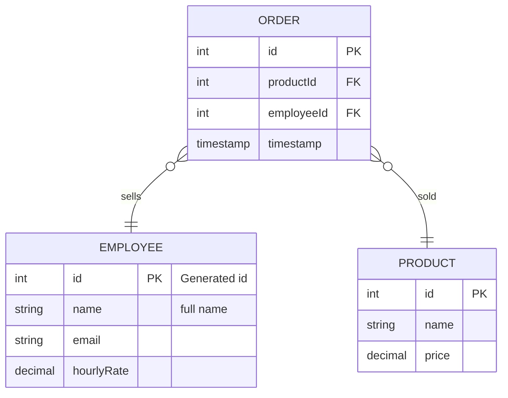
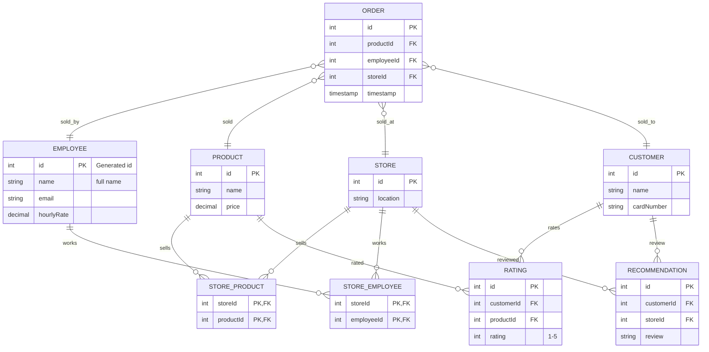

# Brewed Awakenings

## Dependency Graph

```mermaid
flowchart TD
    main["main"]
    Employees(["Employees"])
    Orders(["Orders"])
    Products(["Products"])
    database[("database")]
    main-->Employees
    main-->Orders
    main-->Products
    Employees-->database
    Orders-->database
    Products-->database
```

## Entity Relationship Diagram

```mermaid
erDiagram
    ORDER }o--|| EMPLOYEE : sells
    ORDER }o--|| PRODUCT : sold 
    EMPLOYEE {
        int id PK "Generated id"
        string name "full name"
        string email
        decimal hourlyRate
    }
    PRODUCT {
        int id PK
        string name 
        decimal price
    }
    ORDER {
        int id PK
        int productId FK
        int employeeId FK
        timestamp timestamp
    }
```
## Expanded ERD

```mermaid
erDiagram
    ORDER }o--|| EMPLOYEE : sold_by
    ORDER }o--|| PRODUCT : sold
    ORDER }o--|| STORE : sold_at
    ORDER }o--|| CUSTOMER : sold_to
    STORE ||--o{ STORE_PRODUCT : sells
    PRODUCT ||--o{ STORE_PRODUCT : sells
    STORE ||--o{ STORE_EMPLOYEE : works
    EMPLOYEE ||--o{ STORE_EMPLOYEE : works
    CUSTOMER ||--o{ RATING : rates
    PRODUCT ||--o{ RATING : rated
    CUSTOMER ||--o{ RECOMMENDATION : review
    STORE ||--o{ RECOMMENDATION : reviewed
    EMPLOYEE {
        int id PK "Generated id"
        string name "full name"
        string email
        decimal hourlyRate
    }
    PRODUCT {
        int id PK
        string name 
        decimal price
    }
    ORDER {
        int id PK
        int productId FK
        int employeeId FK
        int storeId FK
        timestamp timestamp
    }
    STORE {
        int id PK
        string location
    }
    STORE_PRODUCT {
        int storeId PK,FK
        int productId PK,FK
    }
    STORE_EMPLOYEE {
        int storeId PK,FK
        int employeeId PK,FK
    }
    CUSTOMER {
        int id PK
        string name
        string cardNumber
    }
    RATING {
        int id PK
        int customerId FK
        int productId FK
        int rating "1-5"
    }
    RECOMMENDATION {
        int id PK
        int customerId FK
        int storeId FK
        string review
    }
```
